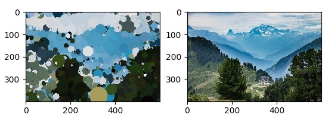
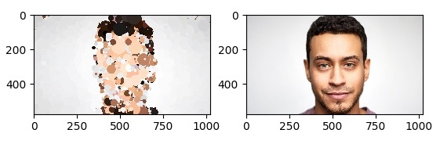
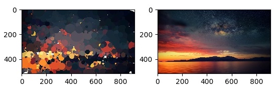

# Metroplex
Recreating pictures using shapes of different colours and sizes via Stochastic Optimization

---

## Samples

Here are some sample images I converted using `Metroplex`. They aren't perfect by any chance. Lots of work left to do – but we'll get there.






---

## Usage

Clone the repository and enter the `src` directory:

```bash
$ git clone https://github.com/rish-16/Metroplex.git
$ cd Metroplex/src
```

```bash
$ python main.py -i "./my_img.jpg" -o ".my_output.jpg" --solo
```

| Flag               | Value   | Description                                                                                              |
|--------------------|---------|----------------------------------------------------------------------------------------------------------|
| `-i` or `--input`  | String  | Path to input image                                                                                      |
| `-o` or `--output` | String  | Path to output image (optional)<br><br>If not present, defaults to `"<<filepath>>_output.jpg"`           |
| `--solo`           | N/A     | Whether output should be a side-to-side<br>comparison or generated image only<br><br>Defaults to `False` |

---

## Under the Hood

`Metroplex` uses a combination of **Simulated Annealing**, **Mutations**, and **Hill Climbing** to choose the optimal shapes. Starting from a blank white canvas, it creates a random shape and scores it. The shape is then mutated and scored again. If the new score is better than the original, we choose the mutated shape. Otherwise, we revert to the previous canvas configuration.

**Normalized Root Mean Square Error** (NRMSE) is used as an objective/scoring function. Over time, this value decays as the Canvas converges to the Target (or something close enough).

```
Canvas = Canvas + Shape
Loss = NRMSE(Target, Canvas)
```

---

## License

[MIT](https://github.com/rish-16/Metroplex/blob/master/LICENSE)
